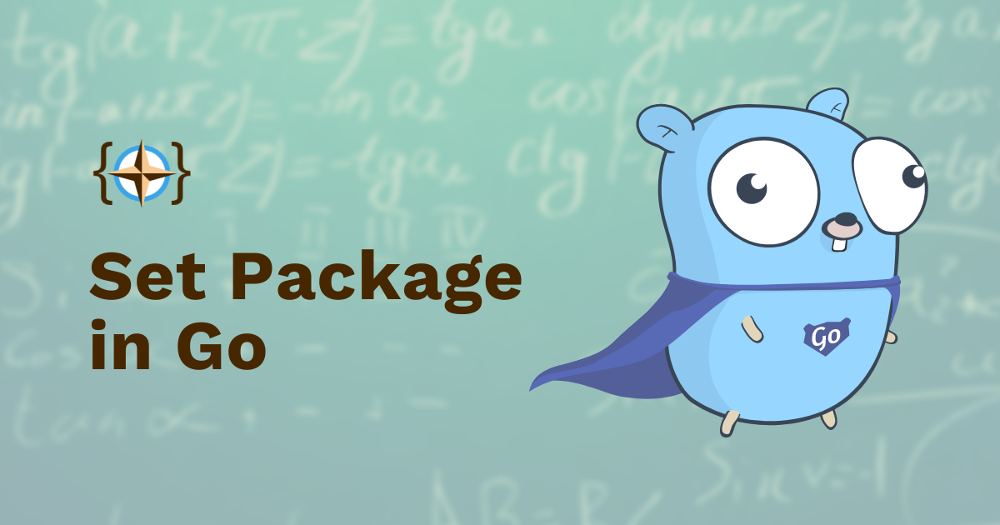

# Go Set Implementation

[](https://github.com/Coders-Compass/set/actions)
[](https://pkg.go.dev/coderscompass.org/set)
[](https://goreportcard.com/report/coderscompass.org/set)
[](SECURITY.md)
[](CODE_OF_CONDUCT.md)
[](LICENSE)
[](https://github.com/Coders-Compass/set/tags)

[](https://coderscompass.org/set)

&copy; [Coders' Compass Publishing](https://coderscompass.org)

## What this project does

This package provides a generic interface and an in-memory implementation of finite sets in Go. It serves both as a practical utility and as a teaching tool for understanding set theory concepts through code.

Key features:
- Generic implementation supporting any comparable type.
- O(1) operations using hash-based storage.
- Complete set theory operations. (union, intersection, difference, etc.)
- Advanced operations like Cartesian product and power set.
- Comprehensive test coverage with examples from set theory.
- Clear documentation connecting mathematical concepts to implementation.

## Why it's useful

Our set implementation helps you:
- Manage collections of unique elements efficiently
- Perform set operations with guaranteed performance characteristics
- Learn set theory through practical code examples
- See how mathematical concepts translate to Go code

## Getting started

### Installation

```bash
go get -u coderscompass.org/set
```

### Basic Usage

```go
package main

import (
	"fmt"

	"coderscompass.org/set"
)

func main() {
	// Create sets
	hobbits := set.NewHashSet[string]()
	fellowship := set.NewHashSet[string]()

	// Add elements
	hobbits.Insert("Frodo")
	hobbits.Insert("Sam")
	fellowship.Insert("Frodo")
	fellowship.Insert("Gandalf")

	// Find intersection
	hobbitFellows := hobbits.Intersection(fellowship)

	// Result contains {"Frodo"}
	expected := set.NewHashSet[string]()
	expected.Insert("Frodo")

	if !hobbitFellows.Equals(expected) {
		fmt.Println("Expected hobbitFellows to be equal to expected")
	} else {
		fmt.Println("hobbitFellows is equal to expected")
	}

	// Advanced operations
	product := set.CartesianProduct(hobbits, fellowship)
	powerSet := set.PowerSet(hobbits)

	// Print results using implicit string conversion
	fmt.Println(product)
	fmt.Println(powerSet)
}
```

### Performance Guarantees

| Operation          | Time Complexity  |
|--------------------|------------------|
| Insert/Remove      | O(1)             |
| Contains           | O(1)             |
| Intersection       | O(min(n, m))     |
| Union              | O(n + m)         |
| Difference         | O(m)             |
| Cartesian Product  | O(n × m)         |
| Power Set          | O(2^n)           |

Here `n` and `m` are the sizes of the two sets involved in the operations.

## Getting help

- [API Documentation](https://pkg.go.dev/coderscompass.org/set)
- [GitHub Issues](https://github.com/Coders-Compass/set/issues)
- [Contributing Guide](CONTRIBUTING.md)
- [Security Policy](SECURITY.md)

## Project maintenance

### Current Status
- Version: 
- Go Version: >= 1.23
- Maintenance: Active

### Contributing

We welcome contributions! See our [Contributing Guide](CONTRIBUTING.md) for details on:
- Code style and standards
- Development setup
- Test requirements
- Pull request process

### Security

For security concerns, please review our [Security Policy](SECURITY.md).

## Learning Resources

- [Set Theory Book](https://coderscompass.org/books/set-theory-for-beginners?utm_campaign=presentation&utm_source=github): Comprehensive guide to set theory concepts
- [pkg.go.dev Documentation](https://pkg.go.dev/coderscompass.org/set): API reference

## License

This project is licensed under the MIT License - see the [LICENSE](LICENSE) file for details.

## Contact

For questions or support, please [contact us](https://coderscompass.org/contact).
